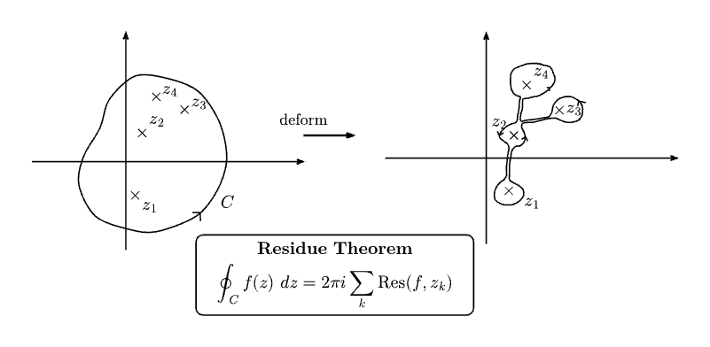
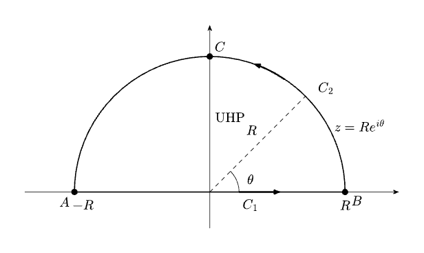
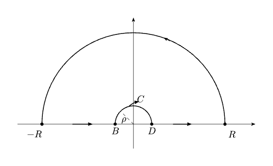

> ✍️ **Added by:** Nikhil Chaudhary , <31/08/2026>

# Singularities, Poles & Residues

## Introduction

In complex analysis, a function is generally well behaved at points where it is analytic. However, at some points the function may fail to be defined or may fail to remain analytic. Such points are called **singularities**. Understanding singularities is important because their local behaviour determines whether a point is removable, a pole, or a more severe type of singularity, and it also leads naturally to the concept of residues.

Singularities are studied by examining the behaviour of a function in a neighbourhood of the point. In particular, the Laurent expansion provides a convenient way to identify the type of singularity and to extract the residue when a pole is present.

## Definition of a Singularity

Let $f(z)$ be a complex function that is analytic in a punctured neighbourhood of $z=a$, i.e. for

$$0<|z-a|<R$$

for some $R>0$. If $f$ is **not analytic at $z=a$**, then $z=a$ is called an **isolated singularity** of $f$.

In simple terms, a singularity is a point where the function ceases to be analytic, even though it is analytic at all nearby points except possibly the point itself.

For an isolated singularity, there are three standard possibilities:

1. **Removable singularity:** $f(z)$ approaches a finite limit as $z\to a$, so the function can be redefined at $a$ to make it analytic.
2. **Pole:** $|f(z)|\to\infty$ as $z\to a$. A pole may be simple or of higher order.
3. **Essential singularity:** the singularity is neither removable nor a pole; the behaviour near $a$ is more complicated.

The sections below begin with the removable case and then develop poles and residues.

## 1. Removable Singularities

Before talking about genuine singularities, it's worth being precise about the ones that aren't
singularities at all. Take

$$f(z) = \frac{\sin z}{z}.$$

Strictly, $f$ is undefined at $z=0$ — the formula gives $0/0$ there, and it *looks* singular
because the denominator vanishes. But

$$\lim_{z\to 0} f(z) = 1,$$

so nothing pathological is actually happening near the origin; redefining $f(0)=1$ makes the
function analytic there too. This is a **removable singularity**, and the standing convention for
the rest of the section (and the rest of the course) is that wherever one turns up, it's assumed
to already have been dealt with this way — otherwise "singular at $z=a$" would technically include
a lot of perfectly well-behaved points.

## 2. Simple Poles

The first genuinely interesting kind of singularity is the **simple pole**. $f(z)$ has a simple
pole at $z=a$ if, in a sufficiently small neighbourhood of $a$, it can be written

$$f(z) = \underbrace{\frac{C_{-1}}{z-a}}_{\text{singular part}} \;+\; \underbrace{\sum_{n=0}^{\infty} C_n (z-a)^n}_{\text{regular part}}$$

The regular part is an ordinary convergent power series — analytic straight through $z=a$; it may
terminate after finitely many terms, or be absent entirely. The singular part is what actually
blows up as $z \to a$. The coefficient $C_{-1}$ (finite, in general complex) is the **residue** of
$f$ at $z=a$ — the notation reminds you it's the coefficient of $(z-a)^{-1}$.

At a simple pole, by definition, the singular part is *literally* just the one term
$C_{-1}/(z-a)$ — but that doesn't mean $C_{-1}$ is always sitting there in plain sight. Example 2
below is the case where it takes a bit of work to expose it.

### Example 1 — $f(z) = \sin(z)/z^2$

From the Maclaurin series of $\sin z$:

$$\frac{\sin z}{z^2} = \underbrace{\frac 1z}_{\text{singular part}} + \underbrace{\left(-\frac{z}{3!}+\frac{z^3}{5!}-\cdots\right)}_{\text{regular part}}$$

Simple pole at $z=0$, residue $=1$. No other finite singularities anywhere in the plane.

### Example 2 — $\mathrm{cosec}{cosec}(z)$

Here the pole location is clear ($\sin z$ has simple zeros at $z=n\pi,\ n\in\mathbb Z$, so
$\mathrm{cosec}(z)=1/\sin(z)$ should have simple poles there) but the residue takes real
work to extract. Taylor-expand $\sin z$ about $z=n\pi$:

$$\sin z = (-1)^n(z-n\pi)\left[1-\frac16(z-n\pi)^2+\frac{1}{120}(z-n\pi)^4-\cdots\right]$$

Inverting the bracket via the binomial series gives

$$\mathrm{cosec}{cosec} z = \underbrace{\frac{(-1)^n}{z-n\pi}}_{\text{singular part}} + \underbrace{\frac{(-1)^n}{6}\left[(z-n\pi)+\frac{7}{60}(z-n\pi)^3+\cdots\right]}_{\text{regular part}}$$

So $\mathrm{cosec}{cosec}(z)$ has a simple pole at every $z=n\pi$, with residue $(-1)^n$ — the sign
alternates from one pole to the next along the real axis. Worth keeping in mind: the residue of a
function need not be a single fixed number; it can (and here does) depend on *which* pole you're
evaluating at.

## 3. The Residue Formula

Doing a full Laurent expansion every time, as Example 2 required, is slow. In general, if $f$ has
a simple pole at $z=a$, the residue can be pulled out directly as a limit:

$$
\mathrm{Res}_{z=a} f(z) = C_{-1}
= \lim_{z\to a}\left[(z-a)f(z)\right]
$$

**Why it works:** multiplying by $(z-a)$ kills the $1/(z-a)$ blow-up, leaving $C_{-1}$ plus a power
series in $(z-a)$. Every term of that series vanishes as $z\to a$, so only $C_{-1}$ survives.

Simple poles very often arise in the form $f(z) = g(z)/h(z)$, with $g,h$ analytic at $z=a$,
$g(a)\ne 0$, and $h$ having a *simple* zero at $a$ (i.e. $h(a)=0$, $h'(a)\ne 0$). In that case
(52A) reduces to

$$\mathrm{Res}_{z=a} f(z) = \mathrm{Res}_{z=a}\frac{g(z)}{h(z)} = \frac{g(a)}{h'(a)}$$

This is the version actually used most in practice — it reproduces both examples above almost
instantly:

| Function | $g(z)$ | $h(z)$ | $h'(z)$ | Residue |
|---|---|---|---|---|
| $\sin z / z^2$ at $z=0$ | (direct limit, see below) | — | — | $1$ |
| $\mathrm{cosec}{cosec} z$ at $z=n\pi$ | $1$ | $\sin z$ | $\cos z$ | $\dfrac{1}{\cos(n\pi)} = (-1)^n$ |

For $\sin z/z^2$, applying (52A) directly: $\displaystyle\lim_{z\to0} z\cdot\frac{\sin z}{z^2} = \lim_{z\to0}\frac{\sin z}{z} = 1$ — same answer as the series computation, no expansion needed.

**Caution:** the $g(a)/h'(a)$ shortcut needs $h'(a)\ne 0$ *specifically*. If $h'(a)=0$ too, the
zero of $h$ isn't simple, $f$ has a higher-order pole, and this formula doesn't apply as-is (see
§4). Also check $g(a)\ne 0$ separately — if $g$ vanishes there too, part or all of the pole can
cancel against the zero of $g$, changing the order of the singularity.

## 4. Extension: Higher-Order (Multiple) Poles

$f(z)$ has a **pole of order $m$** at $z=a$ if, near $a$,

$$f(z) = \frac{C_{-m}}{(z-a)^m} + \frac{C_{-(m-1)}}{(z-a)^{m-1}} + \cdots + \frac{C_{-1}}{z-a} + \sum_{n\ge0} C_n(z-a)^n$$

The residue (still $C_{-1}$, the coefficient of the $(z-a)^{-1}$ term specifically — not any of
the other negative-power coefficients) generalises to

$$\mathrm{Res}_{z=a} f(z) = \frac{1}{(m-1)!}\lim_{z\to a}\frac{d^{m-1}}{dz^{m-1}}\Big[(z-a)^m f(z)\Big]$$

which is exactly same again when $m=1$ (the derivative and the factorial both drop out).

## References

1. Lecture notes, *PH502 — Complex Analysis, Module 1*, Section 5: "Singularities — Poles & Residues," pp. 60–64.
2. A. K. Kapoor, *Complex Variables: Principles and Problem Sessions

--------

> ✍️ **Added by:** Drishya Verma, <01/09/2026>

### 1.1 Essential Singularity 

Extending the definition of a pole: the singular part of $f(z)$ may involve an **unbounded** number of negative powers of $(z-a)$.

$f(z)$ has an **isolated essential singularity** at $z=a$ if, in a neighbourhood of $z=a$, it can be written as

$$f(z) = \underbrace{\sum_{n=1}^{\infty} \frac{c_{-n}}{(z-a)^n}}_{\text{singular part}} + \underbrace{\sum_{n=0}^{\infty} c_n (z-a)^n}_{\text{regular part}} \qquad (54A)$$

As with a pole, $c_{-1}$ is still called the **residue** of $f(z)$ at the singularity.

**Worked example:** $f(z) = e^{1/z} = \displaystyle\sum_{n=1}^{\infty} \frac{1}{n!\,z^n} + 1$, valid for all $z \neq 0$. The series on the right converges absolutely, $f(z)$ has an essential singularity at $z=0$, residue $=1$, and the regular part is just the constant $1$.

### 1.2 Laurent Series 

Representations of complex functions with **both** positive and negative powers of $(z-a)$ (as in the equations for poles and essential singularities above) are called **Laurent series**.

General form:

$$f(z) = \sum_{n=1}^{N} \frac{c_{-n}}{(z-a)^n} + \sum_{n=0}^{\infty} c_n (z-a)^n \qquad $$

- For a **pole**, $N$ is finite (order of the pole).
- For an **essential singularity**, $N \to \infty$.

**Region of validity — worked out from first principles:**

1. *Regular part* is an ordinary (positive-power) convergent power series ⇒ converges inside a circle of radius $r_1$ centred at $z=a$. If the regular part is a polynomial ($c_{n>M}=0$) or, more generally, an entire function, then $r_1 = \infty$.
2. *Singular part*: substitute $w = \dfrac{1}{z-a}$, so $\displaystyle\sum_{n=1}^{N}\frac{c_{-n}}{(z-a)^n} = \sum_{n=1}^N c_{-n}w^n$ — an ordinary power series **in $w$**, convergent inside $|w| < r_2$ for some $r_2$ (infinite if the singular part is a polynomial/entire function of $w$). `
3. Translating $|w|<r_2$ back to the $z$-plane: $\left|\dfrac{1}{z-a}\right| < r_2 \iff |z-a| > \dfrac{1}{r_2}$.
4. **Only if** $\dfrac{1}{r_2} < r_1$ (i.e. $r_1 r_2 > 1$) does an **annular region** exist:

$$\frac{1}{r_2} < |z-a| < r_1$$

Inside this annulus both the regular and singular parts converge absolutely — **this annulus is the region of convergence of the Laurent series.**

**Edge cases:**
- If $r_2 \to \infty$ (i.e. $1/r_2 = 0$), the series converges on a **punctured disk** of radius $r_1$ centred at $z=a$ (with $z=a$ itself excluded).
- In some cases the outer radius $r_1 = \infty$ too, so the annulus extends to infinity.

**Revisit the $e^{1/z}$ example:** $e^{1/z} = \sum_{n=1}^{\infty}\frac{1}{n!}\frac{1}{z^n} + 1$ converges for all $|z|>0$, with $r_1 = \infty$ and $1/r_2 = 0$. Hence the Laurent series is convergent for **all $z\neq 0$** (including as $z\to\infty$). 

**Conclusion:** A Laurent series is, in general, convergent in some annular region whose inner radius may shrink to $0$ and whose outer radius may extend to $\infty$.

### 1.3 Singularity at Infinity — setup only

To classify the behaviour of $f(z)$ at $z=\infty$ in the extended complex plane:

1. Change variable $w = 1/z$ (this maps $z=\infty \to w=0$).
2. Examine the singularity of $\phi(w) \equiv f(1/w)$ **at $w=0$**.
3. The nature of that singularity determines the nature of the singularity of $f(z)$ at $z=\infty$.

## References

1. Lecture notes

---

> ✍️ **Added by:** Jaskirat, 12/09/2026

# Cauchy's Residue Theorem

**Statement:**
Let $C$ be a closed contour lying entirely in a domain where $f(z)$ is analytic except for isolated poles and essential singularities at $\{z_k\}$ with no singularities on $C$. If $C$ winds around each singularity $r_k$ times in the positive (counter-clockwise) sense, then:

$$\oint_C f(z)\,dz = 2\pi i \sum_k r_k \text{Res}_{z=z_k} f(z)$$

**Derivation / justification:**

* By the contour deformation theorem, deform the boundary contour $C$ into small loops surrounding each isolated singularity connected by narrow channels.

* The pairwise contributions of the connecting channels travel in opposite directions and cancel exactly as they are brought infinitesimally close together.

* Expand $f(z)$ in a Laurent series $\sum_{n=-\infty}^\infty a_n (z-z_k)^n$ around each singularity. Using the standard identity $\oint (z-z_k)^n dz = 2\pi i\,\delta_{n,-1}$, only the residue term $a_{-1} = \text{Res}_{z=z_k} f(z)$ yields a non-zero contribution of $2\pi i$.

**Worked example:**
Evaluate the residue contribution for an essential singularity: $f(z) = e^{1/z} + e^z$.

* The series expansion on $0 < \vert{}z\vert{} < \infty$ is:

$$e^{1/z} + e^z = \sum_{n=1}^\infty \frac{1}{n!\,z^n} + 2 + \sum_{n=1}^\infty \frac{z^n}{n!}$$

* The residue at $z=0$ is the coefficient of $z^{-1}$, which is $\frac{1}{1!} = 1$.

* A counter-clockwise loop enclosing $z=0$ gives $\oint_C (e^{1/z} + e^z)\,dz = 2\pi i(1) = 2\pi i$.

**Pitfalls / conditions to watch:**

* **Singularities on the Path:** Cauchy's Residue Theorem requires that no singularities lie directly on the integration contour $C$.

---

# Real Trigonometric Integrals over $[0, 2\pi]$

**Statement:**
For an integral of the form $I = \int_0^{2\pi} f(\sin\theta, \cos\theta)\,d\theta$ where $f$ is a rational function finite on $\theta \in [0, 2\pi]$:

$$I = \oint_{\vert{}z\vert{}=1} f\left(\frac{z - z^{-1}}{2i}, \frac{z + z^{-1}}{2}\right) \frac{dz}{iz} = 2\pi \sum_{\vert{}z_k\vert{} < 1} \text{Res} \left[ \frac{1}{z} f\left(\frac{z - z^{-1}}{2i}, \frac{z + z^{-1}}{2}\right) \right]$$

**Derivation / justification:**

* Substitute $z = e^{i\theta}$, parameterizing the unit circle in the counter-clockwise direction as $\theta$ ranges from $0$ to $2\pi$.

* Differentiating yields $dz = i e^{i\theta} d\theta \implies d\theta = \frac{dz}{iz}$.

* Express the trigonometric functions as $\cos\theta = \frac{z+z^{-1}}{2}$ and $\sin\theta = \frac{z-z^{-1}}{2i}$.

* Apply the Residue Theorem solely to the poles located strictly inside the unit circle ($\vert{}z_k\vert{} < 1$).

**Worked example:**
Evaluate $I = \int_0^{2\pi} \frac{d\theta}{1 + a\cos\theta}$ for $\vert{}a\vert{} < 1$:

* Substitute $z = e^{i\theta}$ and $\cos\theta = \frac{z+z^{-1}}{2}$:

$$I = \oint_{\vert{}z\vert{}=1} \frac{dz/(iz)}{1 + \frac{a}{2}(z + z^{-1})} = -\frac{2i}{a} \oint_{\vert{}z\vert{}=1} \frac{dz}{z^2 + \frac{2}{a}z + 1}$$

* The denominator factors into $(z - z_+)(z - z_-)$ with roots $z_\pm = \frac{-1 \pm \sqrt{1-a^2}}{a}$.

* Since $z_+ z_- = 1$ and $\vert{}a\vert{} < 1$, the pole inside the unit circle is $z_+$ ($\vert{}z_+\vert{} < 1$, while $\vert{}z_-\vert{} > 1$).

* Residue at $z_+$ is $\frac{1}{z_+ - z_-} = \frac{a}{2\sqrt{1-a^2}}$.

* Multiplying by the leading factors: $I = \left(-\frac{2i}{a}\right)(2\pi i)\left(\frac{a}{2\sqrt{1-a^2}}\right) = \frac{2\pi}{\sqrt{1-a^2}}$.

**Pitfalls / conditions to watch:**

* **Incorrect Pole Selection:** Always check magnitudes carefully using relations like $z_+ z_- = 1$; only poles with $\vert{}z\vert{} < 1$ are enclosed by the unit circle.

---

# Integrals of Decaying Rational Functions over $(-\infty, \infty)$

**Statement:**
Let $f(x) = \frac{P(x)}{Q(x)}$ be a rational function with no real poles, where the degree of $Q$ exceeds $P$ by at least 2 (i.e. $\lim_{\vert{}z\vert{}\to\infty} \vert{}z f(z)\vert{} = 0$). Then:

$$\int_{-\infty}^\infty f(x)\,dx = 2\pi i \sum_{\text{Im}(z_k) > 0} \text{Res}_{z=z_k} f(z)$$

> Here we consider the upper half plane

**Derivation / justification:**

* Form a closed contour $\Gamma = C_1 + C_2$ consisting of the real axis segment $[-R, R]$ and a semi-circular arc $C_2$ of radius $R$ in the UHP.

* Parameterize the arc $C_2$ by $z = R e^{i\theta}$ for $\theta \in [0, \pi]$:

$$\left\vert{} \int_{C_2} f(z)\,dz \right\vert{} \le \pi R \max_{\theta} \vert{}f(R e^{i\theta})\vert{}$$

* Because $\vert{}f(z)\vert{}$ decays faster than $1/R$, the product $R \vert{}f(R e^{i\theta})\vert{} \to 0$ as $R \to \infty$, making the arc integral vanish.

* Taking $R \to \infty$, $\oint_\Gamma f(z) dz$ reduces directly to $\int_{-\infty}^\infty f(x) dx$.

**Worked example:**
Evaluate $I = \int_{-\infty}^\infty \frac{dx}{(x^2+a^2)(x^2+b^2)}$ with $b > a > 0$:

* Poles occur at $z = \pm ia$ and $z = \pm ib$; those in the upper half-plane are $z = ia$ and $z = ib$.

* Compute residues:

$$\text{Res}_{z=ia} f(z) = \frac{1}{2ia(b^2-a^2)}, \quad \text{Res}_{z=ib} f(z) = \frac{1}{2ib(a^2-b^2)}$$

* Sum residues and multiply by $2\pi i$:

$$I = 2\pi i \left[ \frac{1}{2ia(b^2-a^2)} - \frac{1}{2ib(b^2-a^2)} \right] = \frac{\pi}{b^2-a^2} \left( \frac{b-a}{ab} \right) = \frac{\pi}{ab(a+b)}$$

**Pitfalls / conditions to watch:**

* **Decay Rate Requirement:** If the denominator degree is only 1 higher than the numerator, because $R\vert{}f(z)\vert{} \not\to 0$.

* **Lower vs. Upper Half-Plane:** The lower half-plane can also be used, but the clockwise contour orientation introduces a negative sign ($-2\pi i \sum_{\text{Im}(z_k) < 0} \text{Res}$).

---

# Integrals with Complex Exponentials

**Statement:**
If $\lim_{\vert{}z\vert{}\to\infty} \vert{}f(z)\vert{} = 0$ in the upper half-plane, and $a > 0$, then the integral over the semicircular arc $C_R$ of radius $R$ vanishes as $R \to \infty$:

$$\lim_{R\to\infty} \int_{C_R} f(z) e^{iaz}\,dz = 0$$

Consequently, $\int_{-\infty}^\infty f(x)e^{iax}dx = 2\pi i \sum_{\text{Im}(z_k)>0} \text{Res} [f(z)e^{iaz}]$.

**Derivation / justification:**

* Set $z = R e^{i\theta} = R(\cos\theta + i\sin\theta)$ on the UHP arc ($0 \le \theta \le \pi$). Then $\vert{}e^{iaz}\vert{} = e^{-a R \sin\theta}$.

* Bound the integral: $\vert{}I_R\vert{} \le \epsilon R \int_0^\pi e^{-a R \sin\theta} d\theta = 2\epsilon R \int_0^{\pi/2} e^{-a R \sin\theta} d\theta$.

* Apply Jordan's inequality $\sin\theta \ge \frac{2\theta}{\pi}$ for $\theta \in [0, \pi/2]$:

$$\vert{}I_R\vert{} \le 2\epsilon R \int_0^{\pi/2} e^{-2a R \theta / \pi}\,d\theta = \frac{\pi\epsilon}{a}(1 - e^{-a R}) < \frac{\pi\epsilon}{a}$$

* Taking $R \to \infty$ gives $\epsilon \to 0$, driving the arc integral to $0$.

**Worked example:**
Evaluate $I = \int_0^\infty \frac{\cos x}{x^2+1}\,dx = \frac{1}{2}\text{Re} \left[ \int_{-\infty}^\infty \frac{e^{ix}}{x^2+1}\,dx \right]$:

* Extend to $f(z) = \frac{e^{iz}}{z^2+1}$, which has a simple pole in the UHP at $z = i$.

* Compute the residue:

$$\text{Res}_{z=i} \left[\frac{e^{iz}}{(z-i)(z+i)}\right] = \frac{e^{i(i)}}{2i} = \frac{e^{-1}}{2i}$$

* Close contour in UHP (since $a = 1 > 0$):

$$\int_{-\infty}^\infty \frac{e^{ix}}{x^2+1}\,dx = 2\pi i \left(\frac{e^{-1}}{2i}\right) = \frac{\pi}{e}$$

* Accounting for symmetry: $I = \frac{1}{2} \left(\frac{\pi}{e}\right) = \frac{\pi}{2e}$.

**Pitfalls / conditions to watch:**

* **Sign of Exponential Factor:** If $a < 0$, closing in the UHP causes $e^{-a R \sin\theta} \to \infty$. We must close the contour in the **lower half-plane** instead.

* **Integrating $\cos(ax)$ directly:** Do not integrate $\frac{\cos z}{z^2+1}$ on the arc because $\cos z = \frac{e^{iz}+e^{-iz}}{2}$ blows up in both half-planes. Always replace $\cos(ax)$ with $e^{iax}$ first, then take the real part at the end.

---

# Indented Contours and the Cauchy Principal Value (CPV)

**Statement:**

* **Fractional Residue Lemma:** If $f(z)$ has a simple pole at $z_0$ and $\gamma_\rho$ is a circular arc of radius $\rho$ subtending an angle $\alpha$, then:

$$\lim_{\rho \to 0} \int_{\gamma_\rho} f(z)\,dz = \pm i \alpha \text{Res}_{z=z_0} f(z)$$

where the sign is positive for CCW and negative for CW.

* **Cauchy Principal Value (CPV):** For a singularity at $x_0 \in (a, b)$:

$$\mathcal{P}\int_a^b f(x)\,dx \equiv \lim_{\epsilon \to 0} \left[ \int_a^{x_0-\epsilon} f(x)\,dx + \int_{x_0+\epsilon}^b f(x)\,dx \right]$$

**Derivation / justification:**

* Expand $f(z)$ in its Laurent series around the simple pole $z_0$: $f(z) = \frac{\text{Res} f(z)}{z-z_0} + \sum_{n=0}^\infty a_n(z-z_0)^n$.

* Parameterize the arc as $z = z_0 + \rho e^{i\theta}$ for $\theta \in [\theta_1, \theta_1 + \alpha]$.

* The non-negative power terms vanish as $\mathcal{O}(\rho)$ when $\rho \to 0$.

* The pole term yields:

$$\int_{\gamma_\rho} \frac{\text{Res} f(z)}{\rho e^{i\theta}} i\rho e^{i\theta} d\theta = i \text{Res}_{z=z_0} f(z) \int_{\theta_1}^{\theta_1+\alpha} d\theta = i \alpha \text{Res}_{z=z_0} f(z)$$

**Worked example:**
Evaluate $I = \int_0^\infty \frac{\sin x}{x}\,dx = \frac{1}{2} \text{Im} \left( \mathcal{P}\int_{-\infty}^\infty \frac{e^{ix}}{x}\,dx \right)$:

* Consider $f(z) = \frac{e^{iz}}{z}$ over the indented contour consisting of $[-R, -\rho]$, the CW small semi-circle $C_\rho$ around $z=0$, $[\rho, R]$, and the large UHP semi-circle $C_R$.

* Inside the closed contour, $f(z)$ is analytic, so $\oint_\Gamma f(z)\,dz = 0$.

* As $R \to \infty$, the integral on $C_R$ vanishes by Jordan's Lemma.

* As $\rho \to 0$, the CW semi-circular indentation ($-\pi$ radians) gives:

$$\int_{C_\rho} \frac{e^{iz}}{z}\,dz \to -i\pi \text{Res}_{z=0} \left(\frac{e^{iz}}{z}\right) = -i\pi(1) = -\pi i$$

* Sum of pieces: $\mathcal{P}\int_{-\infty}^\infty \frac{e^{ix}}{x}\,dx - \pi i = 0 \implies \mathcal{P}\int_{-\infty}^\infty \frac{e^{ix}}{x}\,dx = \pi i$.

* Taking the imaginary part and dividing by 2 yields $I = \frac{1}{2} \text{Im}(\pi i) = \frac{\pi}{2}$.

**Pitfalls / conditions to watch:**

* **Simple Poles Only:** The Fractional Residue Lemma applies to **simple** (order 1) poles; higher-order poles diverge as $1/\rho^{n-1}$ on fractional arcs.

* **Sense of the Indentation Arc:** Indenting into the upper half-plane bypasses the pole by travelling clockwise, yielding a factor of $-\pi i \text{Res}$, whereas counter-clockwise gives $+\pi i \text{Res}$.

---

TODO: SIngularities at INfinity ; and i\espilon thingy

# Residue at Infinity

**Statement:** If a single-valued function $f(z)$ has an isolated singularity at infinity (or even if it is regular there), its residue at infinity is defined as $\text{Res}_{z=\infty} f(z) = -\frac{1}{2\pi i} \oint_C f(z) dz$, where $C$ is a large circle traversed counter-clockwise enclosing all finite singularities. Equivalently, the residue is the coefficient of $1/w$ in the Laurent expansion of $-\frac{1}{w^2}f(1/w)$, defined via the mapping $w = 1/z$.

**Derivation / justification:**

* The large circle $C$ covers all singularities in the finite plane, meaning the sum of all finite residues plus the residue at infinity equals zero: $\text{Res}_{z=\infty} f(z) = -\sum_j \text{Res}_{z=a_j} f(z)$.
* By changing variables to $w = 1/z$, the differential becomes $dz = -1/w^2 dw$.
* The large counter-clockwise circle $C$ in the $z$-plane maps directly to an infinitesimal counter-clockwise circle $c$ around the origin in the $w$-plane.

**Worked example:** Evaluate the residue at infinity for $f(z) = \frac{1}{z-1} + \frac{1}{z-2}$.

* $f(z)$ has simple poles at $z=1$ and $z=2$, and is analytically regular at $z=\infty$.
* Using the sum of finite residues: $\text{Res}_{z=\infty} f(z) = -\left[ \text{Res}_{z=1} f(z) + \text{Res}_{z=2} f(z) \right]$.
* This evaluates to $-\left[ 1 + 1 \right] = -2$.

**Pitfalls / conditions to watch:**

* **Regularity at infinity does not imply zero residue:** Even if a function is regular at infinity, its residue there might not be zero. For instance, $1/z$ is regular at $\infty$ but has a residue of $-1$, though $1/z^2$ has a residue of $0$.
* **Entire functions:** Non-constant entire functions (like polynomials or $e^z$) have an essential singularity at infinity but possess no residue there because the bounding contour $C$ can be shrunk to a point.

---

# Multivalued Functions and Singularities

**Statement:** Inverse functions of many-to-one mappings (like $z^2, e^z$) yield multi-valued outputs because the argument $\arg(z)$ does not return to its initial value after traversing a loop around the origin. A convenient approach to make these functions "good" is to impose a branch cut—restricting the argument to a range like $\theta_0 < \theta < \theta_0 + 2\pi$. Removing this cut line creates a "cut-plane" where each branch becomes a well-defined, continuous single-valued function.

**Derivation / justification:**

* A branch point is defined as a point where looping around it forces the function to comb through different branches.
* To check if $z=\infty$ is a branch point, apply the transformation $t = 1/z$ and examine the behavior at $t = 0$.
* Functions with rational powers $(z-a)^{p/q}$ possess **algebraic branch points**, meaning the branches cycle back to the original value after $q$ loops.
* Conversely, **winding points** generated by $\text{Log} z$ or irrational powers $z^\alpha$ will jump to higher branches indefinitely without ever repeating.

**Worked example:** Defining a single-valued branch for $\text{Log} z$.

* The multivalued expression is $\text{Log} z = \ln r + i\theta + i2\pi m$, which yields infinite branches indexed by $m$.
* By establishing a branch cut along the positive real axis ($\theta_0 = 0$) and restricting the argument to $0 < \theta < 2\pi$, we isolate one single-valued branch.
* Changing the bounding ray $\theta_0$ or selecting a different integer $m$ generates alternative valid single-valued branches.

**Pitfalls / conditions to watch:**

* **Strict inequality on the cut:** The rays $\theta_0$ and $\theta_0 + 2\pi$ must be strictly excluded from the allowed range. Because $\arg(z)$ is fundamentally discontinuous across this ray, the function holds no well-defined value there.
* **Minimum branch point:** All multivalued functions must contain at least two branch points (which can include infinity) to properly define a branch cut between them; a single branch point cannot exist in isolation.

---
